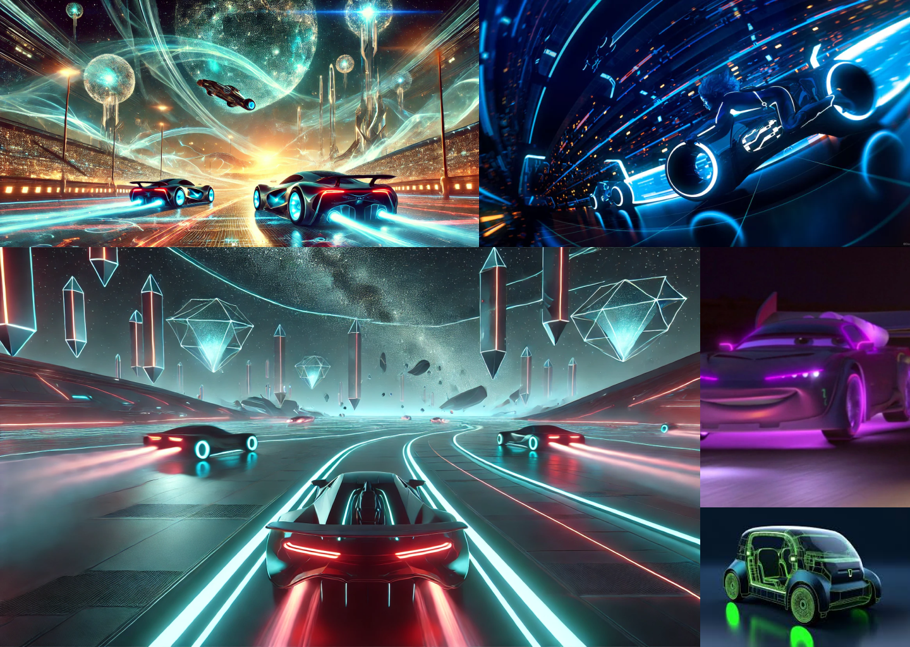
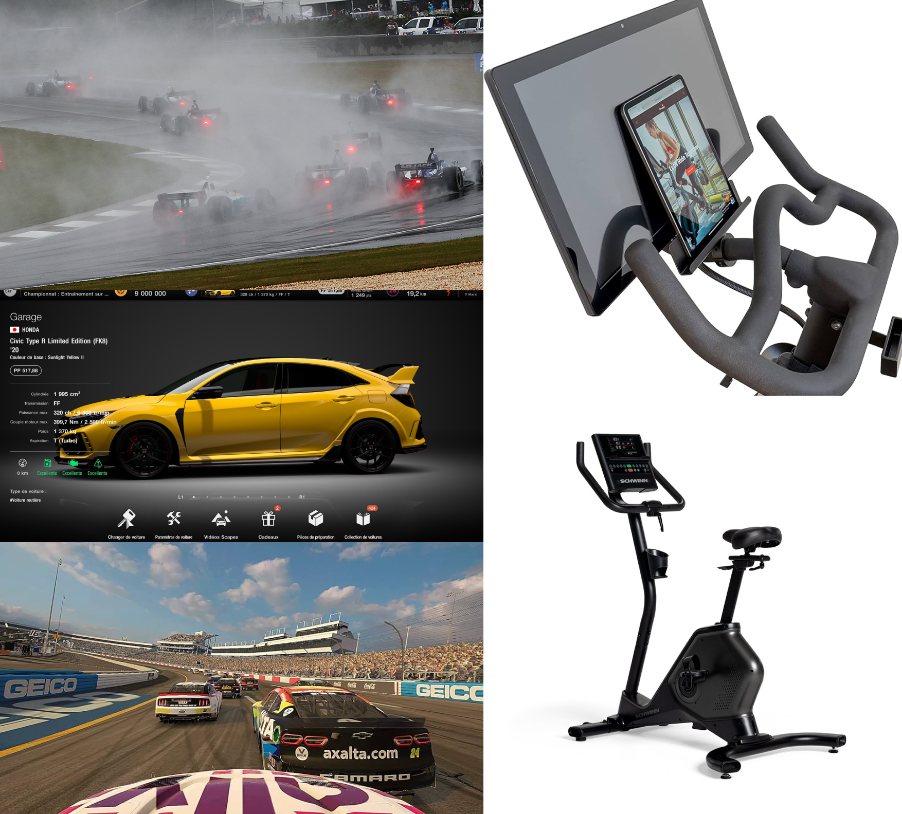
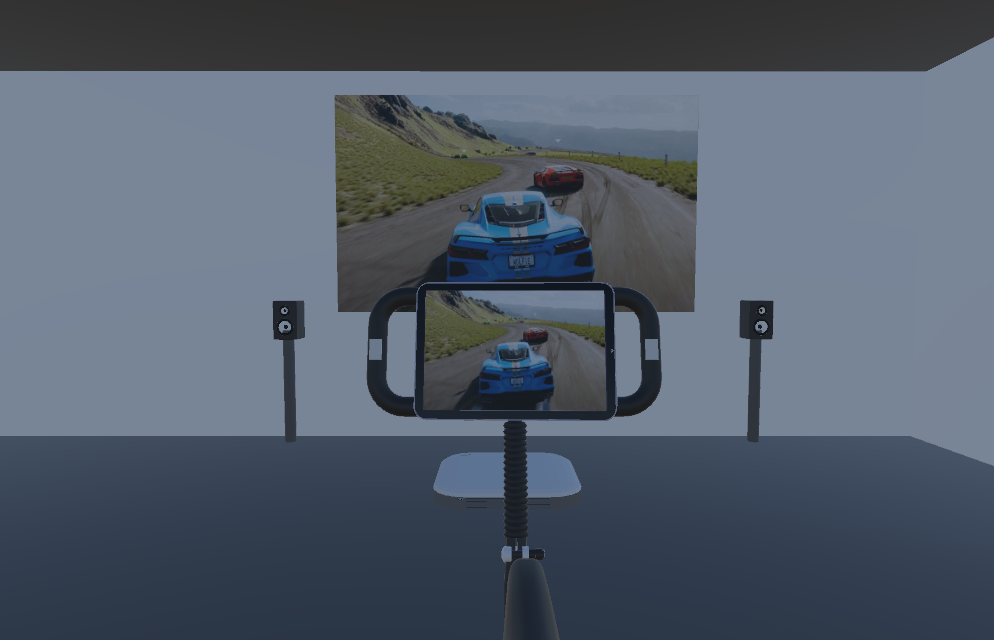

# Concept
## Titre 
C0N DU8 Absurdement Dangeureuse


## Idée
Course de véhicule dans un style de jeu d'arcade.

## Objectif
Donner à l'utilisateur la motivation d'améliorer son cardio par l'intermédiaire d'un jeu intéractif

## Pitch
La vitesse du vélo stationnaire définit la vitesse du véhicule, plus l’utilisateur pédale vite, plus le véhicule accélèrent et le contraire se produit si l’utilisateur ralentit ou arrête de pédaler.

On peut retrouver un frein relié à un moteur qui peut ralentir rapidement l’utilisateur et le véhicule.

Un capteur sur le vélo stationnaire permet de détecter la position du joueurs afin de commencer l'oeuvre. Ce capteur sert aussi de volant; si l'utilisateur se penche vers la gauche, le véhicule va tourner dans cette direction.

Il y a un garage permettant de faire des améliorations aux véhicules et même de changer de véhicules.

Dans la course, il y a plusieurs événements aléatoires et programmés comme la conduite des autres véhicules dans la course, des accidents qui peuvent bloquer la route, des événements météorologiques comme de la pluie ou du vent, l’usure des pneus pourrait rendre le véhicule plus instable.

Collision avec autres véhicules activés.

Plusieurs pistes de course différentes demandant véhicules, pièce et conduite différente.

Il y aurait aussi un bouton à gauche permettant de freiner le véhicule et un a droite permettant d’activer un turbo temporaire.

## Intégration au thème global
Les circuits et les objets disponibles pendant les courses seront étroitement liés au thème de la Résonance. Chaque élément, qu’il s’agisse des circuits, des véhicules ou encore des effets visuels et sonores, sera conçu pour refléter et mettre en valeur cette thématique centrale.

# Artistique

## Ambiance
https://www.youtube.com/watch?v=Ub-VoLqGcx8
https://www.youtube.com/watch?v=ODFY81dDpjQ
## Moodboard


## Scenarimage





## Illustrations des interactions


# Technique
## Scénario
```mermaid
flowchart TD
    A[Veille] -->|Interaction| B[Gagne aléatoirement 4 véhicules]
    B --> C{Menu}
    C -->|Jouer| D[Commence le jeu]
    C -->|Instructions| E[Affiche les instructions]
    C -->|Quitter| F[Quitter l'expérience]
    F --> A
    E--> |Menu| C
    H --> J{course}
    J --> K[Course continue]
    K -->|Denrier Tour fini| M[Fin de course]
    K -->|Pédale| N[Accélère]
    K -->|Prend des dégâts| O[Ralenti grandement]
    O --> K
    P --> K
    K -->|Attaque un ennemi| P[Ennemi ralenti grandement]
    N --> K
    M --> Q[Gagne une récompense]
    Q --> |Recommencer| H
    Q --> |Retour menu| C
    D --> I[Garage]
    I --> H[Choisir la course]
  
   

  ```

## Flux de données


  
## Plantation


## Circulation des visiteurs
Un utilisateur a la fois, celui-ci est amené a s'installer sur le vélo stationnaire et de commencer l'expérience avec l'écran positionner sur le vélo.

## Gestion des câblages
Un point d'allimentation pour le vélo stationnaire, projecteur et haut-parleur et un point d'allimentation pour les lumieres.


##  Devis Technique
### Équipements fournis par le Cégep
- 1x Projecteur Ultra Short 
- 1x Vélo Stationnaire modifié 
- 2x [Haut-parleur](https://www.genelec.com/8040b)
- 1x Écran Tactile
- 1x Ordinateur Portable
- [XLR](https://www.amazon.ca/AmazonBasics-C%C3%A2ble-microphone-m%C3%A2le-femelle/dp/B01JNLTTKS/ref=sr_1_1_ffob_sspa?dib=eyJ2IjoiMSJ9.Qc7Bm99GBP3_XdgZcQz45tvwI3ZqROZzvEu4V-F-QT388d0dx-YLODgUtsRmCb0TR1FPGUPEwhox88PlZm-JDHYXqmpN1VxeKf3W5k1g5NU1RZ2TFPbPHEgvEOSrXuJr0p9KFPer01MgBdV8xSHpXD5YZ1GfRCRcvu-F_YgfHtW0nnIjJADUKZ3dbmYpX97Y90rhmCpxBn37eHkWwjjazddP0l0gZG9GyMqQk0WBrxC5mV0aQjAITQ2gDr7Wvfz22xvF73O-EgQPh9p3sYhI7UYglNw0inOt6GjZYTSyBVE.dWFeMSa3GcqU8O-ySO4vj7Pt5r6aBAjf_mexNg1_OKA&dib_tag=se&hvadid=208379556679&hvdev=c&hvlocphy=9000598&hvnetw=g&hvqmt=e&hvrand=5867566891861396795&hvtargid=kwd-299658550019&hydadcr=5480_9838916&keywords=cable%2Bxlr&qid=1730664946&sr=8-1-spons&sp_csd=d2lkZ2V0TmFtZT1zcF9hdGY&th=1)
- [XLR_USB](https://www.amazon.ca/femelle-microphone-adaptateur-instruments-enregistrement/dp/B07WR14TYX/ref=sr_1_4_sspa?__mk_fr_CA=%C3%85M%C3%85%C5%BD%C3%95%C3%91&crid=2IOWF3QHGFSZN&dib=eyJ2IjoiMSJ9.dQGpMpgA9Iulza1HVu-XlK5gRTuLdXG4dKc3tbkKYKA-jMTHiCHNEq1TxnnkXODERf6h6RV-d2g33HtukI6CtW-rpr89U-fAFdxlsNMZ4OfGr21F6ud2zMlh0LZVeyRD0NEMft_wn6JiwvrKmUaYTlQTdfAbuoZpqtVW8t33pGZMe2eCrpvzHhdHhy04AVP7s8HqiZ-ufZRq5aGKWQAI3qPhduy1nDt4jcRi3K5roeoHq32kwXn4Mz8g2hQ1RTwyvAErp7RcdgnHTD0Kfsecbc5vVrnb_O79Sg42bqguw1c.Nf0Li0DKLt-J9auJCgwXc5akNUq49SsF3rtb7SSuqas&dib_tag=se&keywords=cable+xlr+usb&qid=1730665110&sprefix=cable+xlr+usb%2Caps%2C83&sr=8-4-spons&sp_csd=d2lkZ2V0TmFtZT1zcF9hdGY&psc=1)
### Équipements a acheté
- 2x Boutons

### Estimation des coûts
- 500$ (trust)

##  Logiciel
- Unity
- Unreal Engine 5
- Visual Studio Community 2022
- Maya
- Blender
- Touch Designer
- Arduino
- Houdini
- Reaper

# Gestion d'équipe
## Distribution des tâches
### Programmation Engine
- Ian Corbin
- Alexandre Gervais
- Jérémy Roy-Côté

### Programmation Arduino et autres
- Ian Corbin
- Alexandre Gervais
- Jérémy Roy-Côté

### Modélisation Véhicules
- Ian Corbin
- Samuel Desmeules-Voyer
- Alexandre Gervais
- Jérémy Roy-Côté
- Keven Malric

### Animations
- Samuel Desmeules-Voyer

### Environnement 3D
- Ian Corbin

### Ambiance Général
- Jérémy Roy-Côté
- Keven Malric
- ian cobrin
  
### Installation de l'oeuvre
- Keven Malric

### VFX
- Keven Malric

### Montage Sonore
- Alexandre Gervais


## Motivations
### Équipe
Notre équipe est motivé par l'opportunité de réaliser un jeu vidéo qui est assemblé en 3D et qui amènera les utilisateurs à faire une activité saine pour jouer au jeu.

### Ian Corbin
Ce qui me motive, c’est l’idée de créer un jeu interactif contrôlé par un vélo stationnaire, un projet qui combine activité physique et immersion ludique. J’ai à cœur d’offrir aux utilisateurs une expérience unique, où l’effort physique devient une source de motivation et de satisfaction en les poussant à se dépasser pour remporter une course palpitante.

### Samuel Desmeules-Voyer
J'ai toujours voulu faire un jeu vidéo et j'ai toujours aimé l'animation 3D. Ce projet me permet d'accomplire un rêve d'enfance.

### Alexandre Gervais
Je suis motivé par l'approche de comment contrôler un jeu d'une façon unique et bénéfique pour la santé humaine avec des médias de qualité et de l'humour. Faire au moins un jeu vidéo est un rêve depuis que je suis tout jeune.

### Jérémy Roy-Côté
La création de jeux vidéos, la modélistion 3D et la programmation, est un rêve d'enfance. Je pense aussi que ça sera une bonne expérience pour le marché du travail et bon pour mettre dans mon portfolio.

### Keven Malric

je suis motivé par l'idée d'aider les gens à poursuivre une meilleur santé par la proposition d'un jeu qui encourage l'effort physique. je trouve mon que mon équipe est soudé pour ce travail et cette solidarité me pousse à me surpasser au sein de l'équipe. se qui est ma plus grande source de motivation, c'est l'idée de pouvoir inspirer la prochaine génération à avoir de saine habitude de vie tout en s'amusant, car la vie est courte est il est important pour moi de profiter du présent et de notre santé.

## Étude de risques


```mermaid
gantt
    title Échéancier expérience multimédia interactive
    dateFormat  YYYY-MM-DD
    section Conception
    Scénarisation du projet        :a1, 2024-12-13, 5w
    section Planification
    Planification du projet        :a1, 2025-01-21, 2w
    section Production
    Production des contenus      :a2, after a1, 5w
    Installation technique       :a3, after a1, 5w
    section Tests et ajustements
    Tests et ajustements finaux  :a4, 2025-03-10, 1w
    section Diffusion
    Semaine de diffusion         :a5, 2025-03-17, 1w
    section Démontage
    Démontage                    :a6, after a5, 1d
```


# Références
- Moodboard:
- [Référence1](https://www.clubpiscine.ca/images/detailed/117/Schwinn-24-190-Velo-Stationnaire-Vertical-177710-1.jpg)
- [Référence2](https://digbza2f4g9qo.cloudfront.net/-/media/IndyCar/News/Standard/2018/04/04-22-Hairpin-Blinding-Sprays-ALA.jpg?vs=1&d=20180422T234030Z)
- [Référence3](https://encrypted-tbn3.gstatic.com/images?q=tbn:ANd9GcTo1dU64AMhI68syuVtUIBoF7c_xdoEQAiZCGAyBmDAPbQLik_V)
- [Référence4](https://assets.nintendo.com/image/upload/ar_16:9,b_auto:border,c_lpad/b_white/f_auto/q_auto/dpr_1.5/c_scale,w_400/ncom/software/switch/70010000048501/b316ae3121445fd241a09bd050fcf72c893a910d01701b283e044319a48681fd)
- [Référence5](https://m.media-amazon.com/images/I/718x3CW0NPL._AC_UF894,1000_QL80_.jpg)
- [Référence6](https://www.youtube.com/watch?v=Ub-VoLqGcx8)
- Scenarimage:
- [Garage](https://www.google.com/url?sa=i&url=https%3A%2F%2Fin.pinterest.com%2Fpin%2Fcar-parking-gui-by-haris-javed--812477589049452655%2F&psig=AOvVaw3AvRxQyjS3shZadPyjVS99&ust=1730735224096000&source=images&cd=vfe&opi=89978449&ved=0CBQQjRxqFwoTCOCi2qfBwIkDFQAAAAAdAAAAABAE)
- [Environnement](https://www.google.com/url?sa=i&url=https%3A%2F%2Fsikandarali.artstation.com%2Fprojects%2F3dGdeE&psig=AOvVaw1P5MR8IjTcrerU8F0NdmwT&ust=1730735433611000&source=images&cd=vfe&opi=89978449&ved=0CBQQjRxqFwoTCOi52orCwIkDFQAAAAAdAAAAABAE)
- [Choix carte](https://www.google.com/url?sa=i&url=https%3A%2F%2Fgraphicriver.net%2Fitem%2Fcar-racing-game-ui-kit%2F37300508&psig=AOvVaw1P5MR8IjTcrerU8F0NdmwT&ust=1730735433611000&source=images&cd=vfe&opi=89978449&ved=0CBQQjRxqFwoTCOi52orCwIkDFQAAAAAdAAAAABAT)
- [Course](https://www.google.com/url?sa=i&url=https%3A%2F%2Fus.idyllic.app%2Fquiz%2F2qiq584kuk-which-racing-game-car-best-fits-your-style&psig=AOvVaw0KmPhRodsYiLtyTW2M-G5c&ust=1730735570002000&source=images&cd=vfe&opi=89978449&ved=0CBQQjRxqFwoTCLDz88zCwIkDFQAAAAAdAAAAABAE)
- [Speaker](https://sketchfab.com/3d-models/speaker-94a91248c6de47d8a85f60fa8111c859)
- [Vélo](https://sketchfab.com/3d-models/stationary-bike-299d993f9eb94d6684562de7dca3514c)
- [Ecran](https://sketchfab.com/3d-models/interactive-display-b40454d8c4ab4fdb923fdb29bc8aa1f0)
- [Projecteur](https://sketchfab.com/3d-models/interactive-display-b40454d8c4ab4fdb923fdb29bc8aa1f0)
